# Grupo 15 - Proyecto Final

Diagramas de Casos de Uso

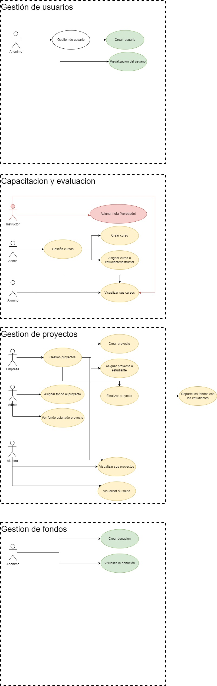

Contratos desplegados en la Tesnet de Sepolia mediante Dashboard de Truffle

Contrato de Gestion de Proyectos
https://sepolia.etherscan.io/tx/0x230eb95ddcd85d995006a4e93ca82e94112816e9990d14d9aab589d28ba0ed6a

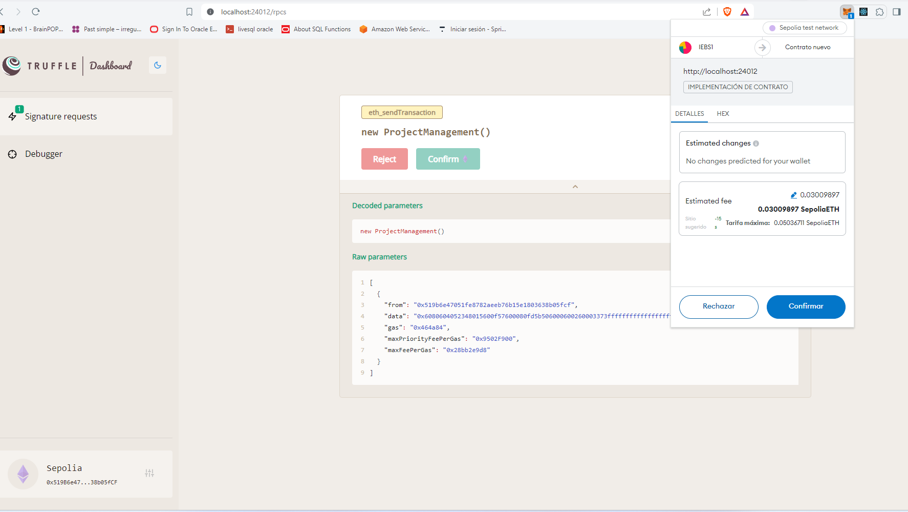

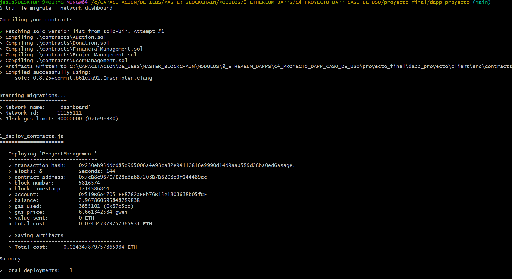

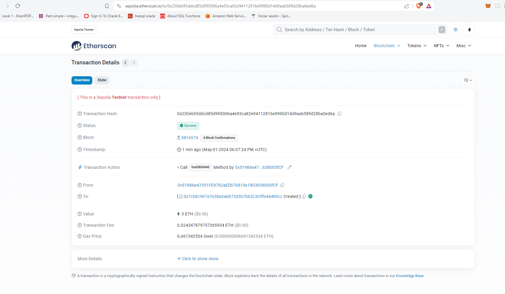

Verificamos el contrato con
   truffle run verify ProjectManagement@0x7cB8c967E7E28a3a687203B7B62C3c9fB44489cc --network dashboard
   

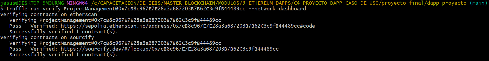

Contrato Verificado
https://sepolia.etherscan.io/address/0x7cb8c967e7e28a3a687203b7b62c3c9fb44489cc#code

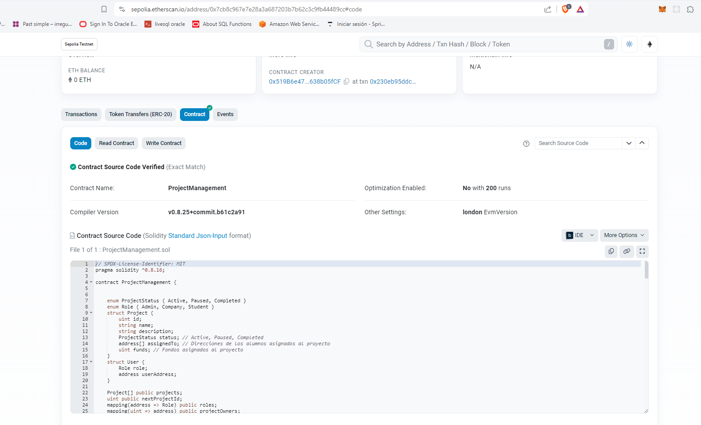

# Grupo 15 - Sprint 2

  
# EtherScan

Contratos desplegados en la Tesnet de Sepolia mediante Dashboard de Truffle

Contrato de Donacion
https://sepolia.etherscan.io/tx/0x80f1514e52e149cde56ca0bb9755c04cdafb97de08b16ad478b1f3185a6c8d65

Contrato de Usuarios
https://sepolia.etherscan.io/tx/0x0c68847be9251b0295594d9f4407e12b6b77a200e648c415f2bc6157c3f182ea

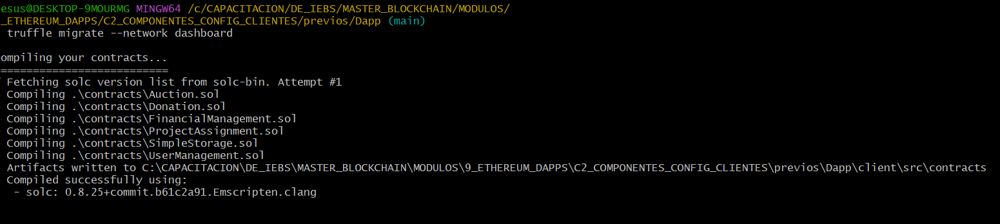

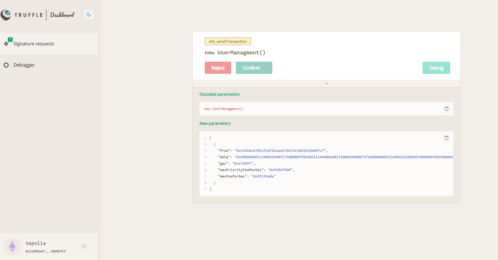

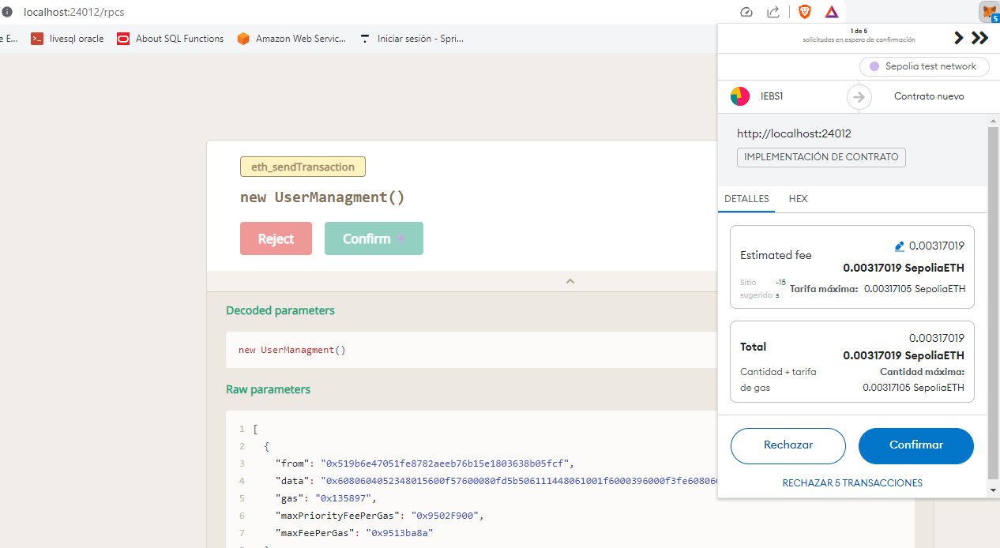

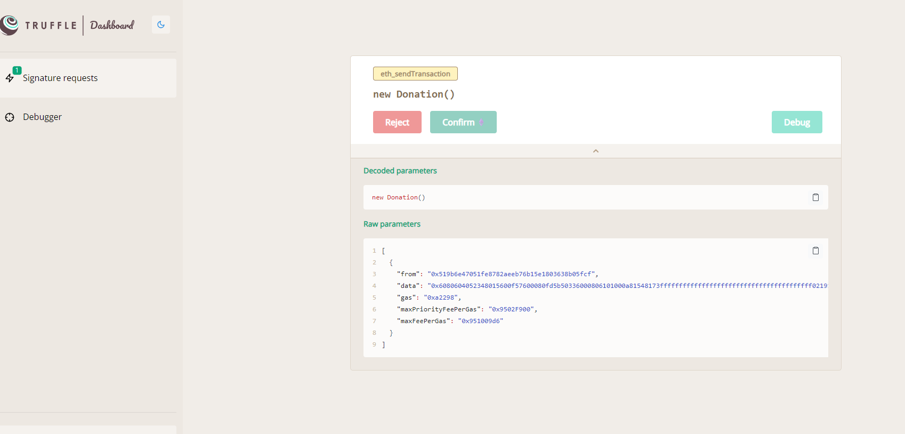

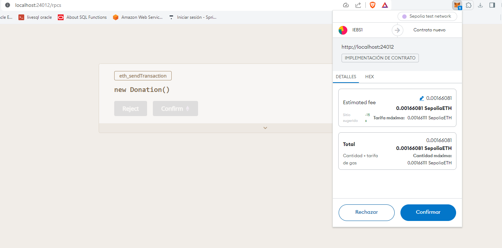

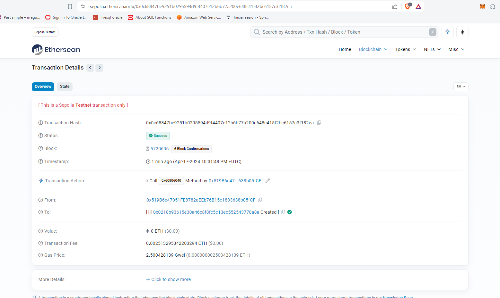

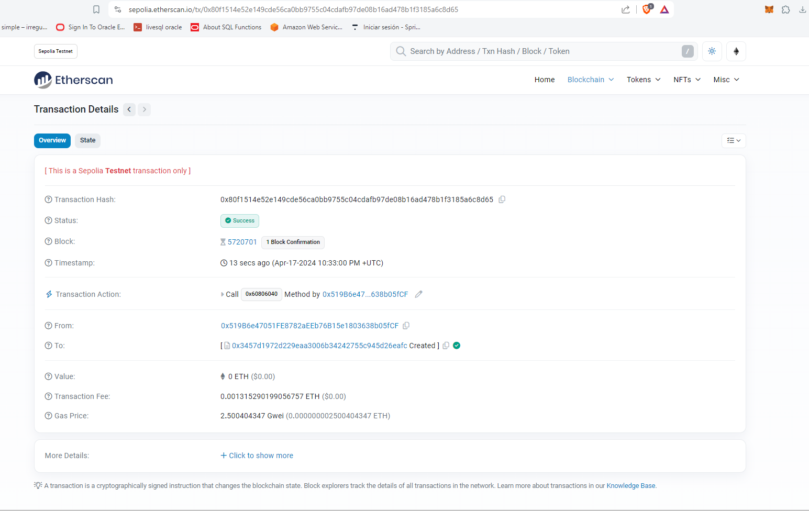

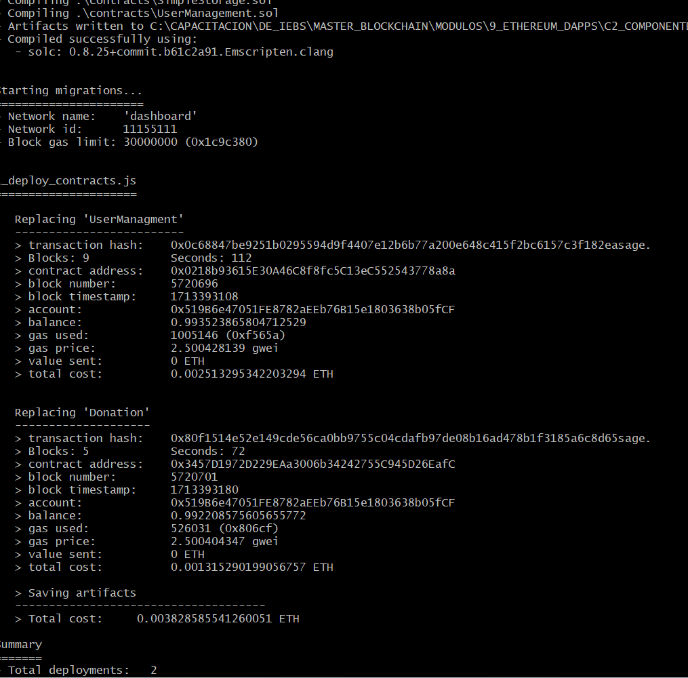

